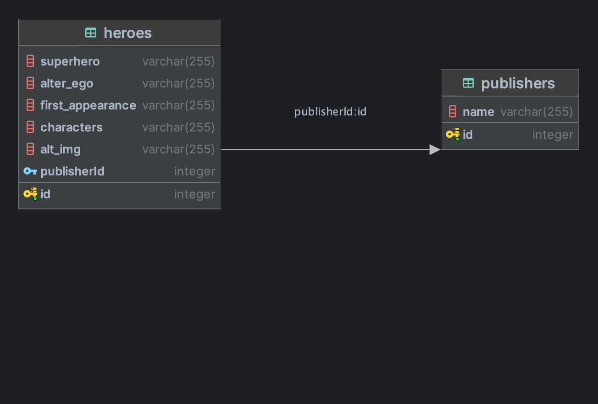

# heroes-service
RestAPI, NodeJs, Express, Sequelize, Postgres

## Nodejs Sequelize RESTAPI PostgreSQL

This is a simple REST API using Javascript Technologies and PostgreSQL.

- nodejs
- express
- postgreSQL
- sequelize

## Modeling

This is the basic relationship that we are using in this example



## Project Structure

```bash
.
├── README.md
├── docs
│   └── diagram.png
├── package-lock.json
├── package.json
├── requests
│   ├── heroes.http
│   └── publishers.http
├── sql
│   ├── db.sql
│   └── init_docker_postgres.sh
└── src
    ├── app.js
    ├── controllers
    │   ├── hero.controller.js
    │   └── publisher.controller.js
    ├── database
    │   └── database.js
    ├── index.js
    ├── interfaces
    │   └── HeroDTO.js
    ├── models
    │   ├── Hero.js
    │   └── Publisher.js
    └── routes
        ├── heroes.routes.js
        └── publisher.routes.js

9 directories, 18 files
```
